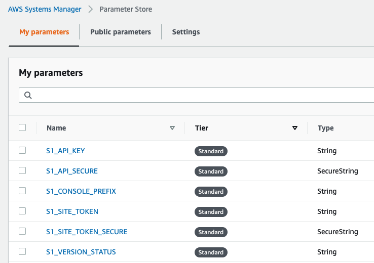
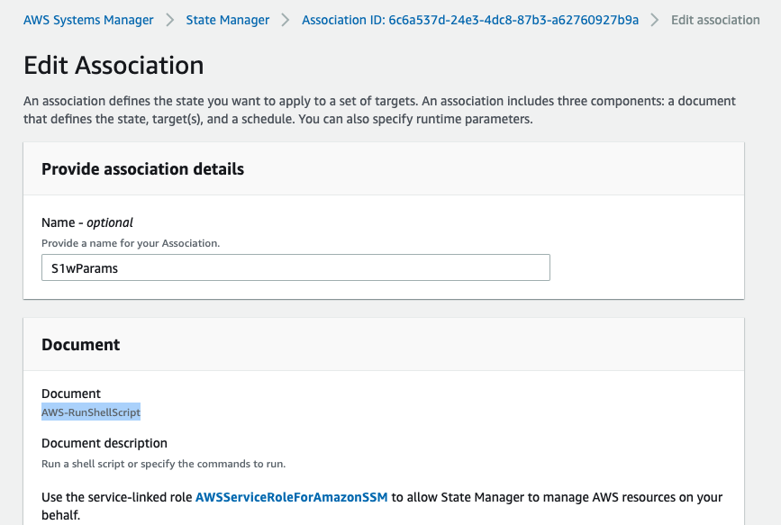
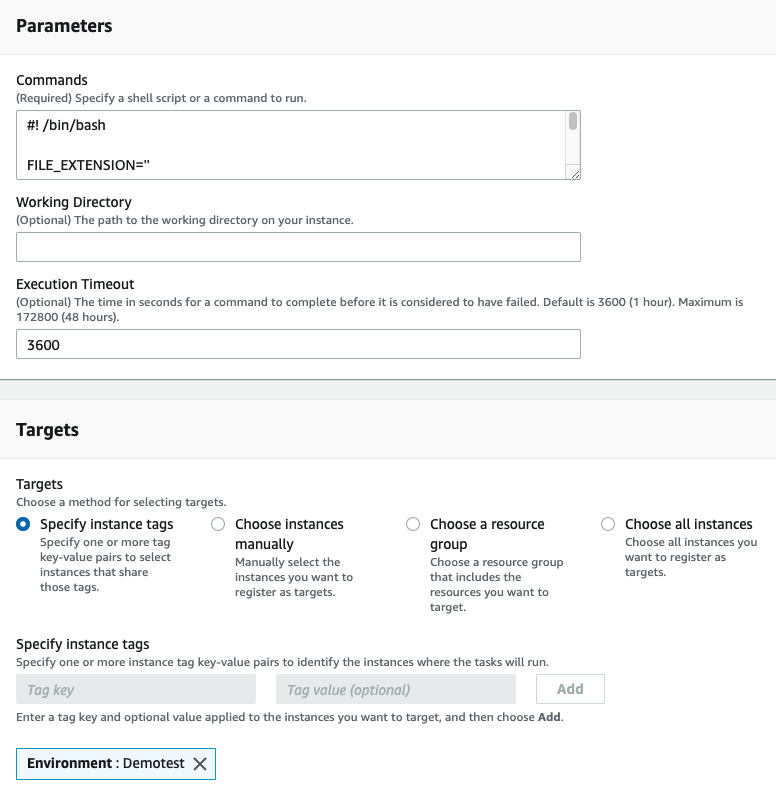
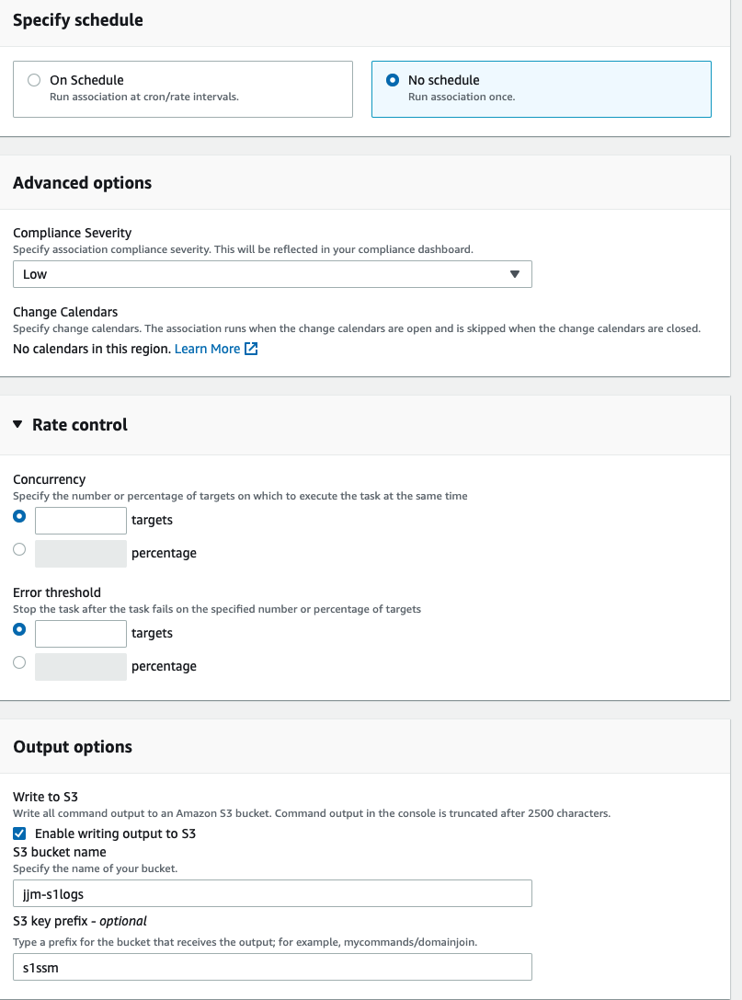

## Basic Screenshots used to deploy the S1 agent using AWS SSM State Manager.

1. SSM requires the instance to have a role associated with SSM permissions.  More details can be found [here](https://docs.aws.amazon.com/systems-manager/latest/userguide/setup-instance-profile.html).
    - A sample shell script can be found [here](ssm_notes.sh).  This script is meant to run on various flavors of linux and should be modified to suit your individual needs.
2. SSM Parameter Store is used to create 4 parameters that are called in the script.  API Key, Site Token, Console Prefix, and Version.  This screenshot shows the API Key and Site Token as both unencrypted and secure.  The script calls the secure iteration of the string.
    - API Key 
        - i.e. - LGPZhvVH6TThq28ncIlBxg****************************kxqxaRpwE5iHoDAfN1G5d
    - Site Token 
        - i.e. - eyJ1cmwiOiAiaHR0cHM6Ly91c2VhMS1w**********************************ogIjBhYjQyMzUyMGIxOTNjYzMifQ==
    - Console Prefix 
        - i.e. - usea1-purple
    - Version 
        - i.e. - ga     
        - **NOTE** Case Sensitive

    

3. We use SSM State Manager run a Shell Script on the instances that are triggered via the existence of a tag.  State Manager can trigger on a Tag, Manually, on an entire resource group or for all instances.
    

4. **NOTE** the commands run in the parameters section do not fit in the screen shot.  That script will be included externally.
    

5. S3 logging is optional but beneficial for troubleshooting.
    
